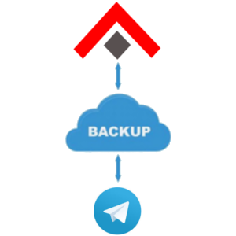

# Telegram automated db backup



This repo provides a Python script that does a **daily backup** and upload it automatically to a Telegram group chat.
This way, you do not need to take care of where to save the backups or buying any cloud service.


## How does it work?

The Python script it's based on:
- pyrogram
- unix commands (like mysqldump, zip)

**Pyrogram** is a python framework which allows you to use your [Telegram](https://telegram.org) account, so with this framework you can send a message, files, pictures etc. automatically without doing it manually.


### Requirements

To use the script `bak.py` you need:
- a Telegram account
- python3
- pyrogram
- tgcrypto (optional, but recommended)
- zip
- mysql-client (for mysqldump)

To install these software in a Linux distro **Debian-based** you can run:
```bash
$ sudo apt install python3 python3-pip zip mysql-client
```

To install the python packages you can use the python package manager **pip**:
```
$ pip3 install pyrogram tgcrypto
```

### Configuration
Please replace the following values with your personal data
```python
# database connection config
mysql_localhost = "localhost"
mysql_username = "USERNAME"
mysql_password = "PASSWORD"

world_db = "acore_world"
char_db = "acore_characters"
auth_db = "acore_auth"

# zip config
zip_password = "db_zipped"
zip_name = "db-{:%Y%m%d}.zip".format(datetime.now()) # this will result in a string like "db-20211231.zip"

# replace "me" with a chat_id or username to change the chat
char_id = "me"
# Telegram client config
username = "TELEGRAM_USERNAME"
api_id=1234567
api_hash="1234d401234d401234d401234d40"
```

### Usage

To allow pyrogram to use your account you need to have an username on Telegram and create a Telegram 3rd "app" here: https://my.telegram.org/auth?to=apps.
Generated the app, this app will have **api_id** and **api_hash**, put these data into the conf part in`bak.py`.

Afterward, fill the mysql credentials and the zip password and run the python script using
```bash
$ python3 bak.py
```

Note: alternatively, you can also run `bak-per-table.py` if you want to make a backup with one file per table instead of one file per db.

The first time, pyrogram will need from your telegram account a TOKEN that you will receive on Telegram, after this, pyrogram will generate a sqlite database in the same directory of bak.py to keep the session with your Telegram user.

Finally, you just need to run the script bak.py and your db will be pushed in your personal chat ("Saved Messages" / "me").

You can change the chat where push the zip archive, replacing "me" on line 30 with a chat_id or a Telegram @Username,
if you don't know your chat_id you can send the message `/chatid` to [@GiveChatId_Bot](https://t.me/GiveChatId_Bot) or if you need to know the chat_id of a group you can add this bot to the group and ask `/chatid`.

### Optional, run it daily using crontab

To run the script daily you can create a cronjob using `crontab` (usually it is installed as default on a Linux server).
So open crontab using:
```
$ crontab -e
```

Fill the last line with:
```
0 0 * * * cd ~/root/path/project/; python3 bak.py
```

This will run the script daily on at midnight 😉.

That's all!
Open an issue if you need anything.


## Credits
- [Helias](https://github.com/Helias)
